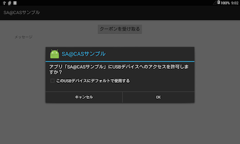
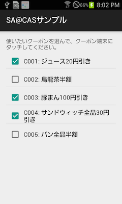
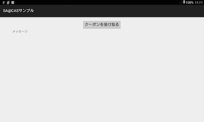
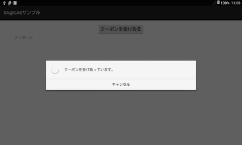
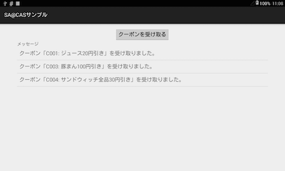

# SA@CAS SDK for Android Developer's Guide

## 更新履歴

| バージョン  | 日付      | 変更内容                  |
|-------------|-----------|---------------------------|
| 1.1         | 2015/4/27 | SaacasSSCListenerを追加。 |
| 1.0         | 2015/4/7  | 初版                      |


## SA@CAS SDK for Android について

SA@CAS SDK for Android は、SSC通信を行うためのAndroid用ライブラリです。

このライブラリは次の機能をサポートします。

* USB接続タイプのSSC通信モジュール経由で超音波通信を行うSSCクライアントの実装を可能にします。
* スマホ用SSC SDKをラップし、JavaのみでSSCリスナーの実装を可能にします。


### 前提条件

このライブラリを使用するための前提条件は以下の通りです。

* Android 4.0 (API Level 14) 以上


### 利用方法

次の二つのAARファイルをプロジェクトに組み込んでください。

* **sscsdk-android-usb-1.0.0.aar**  
  USB接続タイプのSSC通信モジュール経由で超音波通信を行うため低レベルAPIを提供するライブラリです。  
  SA@CAS SDK for Android の超音波通信処理は、このライブラリに依存しています。

* **saacassdk-android-1.1.0.aar**  
  上記ライブラリ、及びスマホ用SSC SDKを抽象化したラッパーライブラリです。


## 実装
SA@CAS SDK for Android を使った超音波通信は、以下の流れで行います。

### 1. 超音波通信環境をセットアップする

超音波通信を行う際は、必ず事前にセットアップ処理を行ってください。

```
public class MainActivity {
    protected void onStart() {
        super.onStart();
        SaacasSSCClient.getInstance().prepare(this);
    }
}
```

なお、このメソッド内でUSBを利用するためのパーミッションリクエストを行います。
そのため、次のようなダイアログが表示されます。



### 2. 超音波通信コネクションを開く

次に、`SaacasSSCClient#open` を呼び出して、超音波通信コネクションを開きます。
このメソッドを呼び出すと、SSC通信モジュールがポーリングを開始します。
ユーザーがスマートフォンをSSC通信モジュールにかざすと、超音波通信コネクションが確立され、データの送受信が可能になります。

```
SaacasSSCClient.getInstance().open();
```

なお、スマートフォンをかざして超音波通信のコネクションが張られる際、
リスナー（スマートフォン側のアプリ）のデータ受信コールバックが呼び出されます。
ですが、この時点ではデータの暗号化が行われていないため、
このタイミングではデータの送受信を行わないという前提でSDKを設計しています(リスナーからのレスポンスは無視します)。

リスナーのデータ受信コールバックの初回受信処理(`sd_sscCbPara`の`cnt`が0の場合)は、
空のレスポンスを返すように実装してください。

### 3. データを送信する

超音波通信コネクションが開いている間は、`SaacasSSCClient#send` でスマートフォンにデータを送信できます。
戻り値として、スマートフォンから返されたレスポンスパケットを受け取ることができます。

```
String requestCode = "0000";
String data = "ABCDEFG";
Packet packet = SaacasSSCClient.getInstance().send(requestCode, data);
```

なお、処理コードは4バイト固定、データは最大120バイトまで送信可能です。

データ部の文字コードはUTF-8としてください
（送信時は、データ部をUTF-8のバイト列に変換して送信します。受信時は、データ部をUTF-8とみなして文字列に変換します）。

### 4. 超音波通信コネクションを閉じる

必要な通信が完了したら、`SaacasSSCClient#close` で超音波通信コネクションを閉じます。

```
SaacasSSCClient.getInstance().close();
```

なお、`SaacasSSCClient` のメソッドは、呼び出されたスレッドで処理を行うので、UIスレッドをブロックしないように、
2から4はワーカースレッドで実行すべきです。

以下に、`AsyncTask` で超音波通信を行うサンプルを示します。

```
public class Task extends AsyncTask<Object, Integer, Packet> {
    protected Packet doInBackground(Object... params) {
        SaacasSSCClient ssc = SaacasSSCClient.getInstance();
        ssc.open();
        Packet packet = ssc.send("0001", "ABCDEFG");
        ssc.close();
        return packet.
    }
}
```

### 5. 超音波通信環境をクリーンアップする

超音波通信を行う必要がなくなったら（アプリ終了時や画面遷移時など）、`SaacasSSCClient#dispose` を呼び出してください。

```
public class MainActivity {
    protected void onStop() {
        super.onStop();
        SaacasSSCClient.getInstance().dispose();
    }
}
```

## クラスライブラリ

### SaacasSSCClientクラス

超音波通信機能を提供するクラスです。

* `public static SaacasSSCClient getInstance()`  
  SaacasSSCClientのシングルトンインスタンスを取得します。

* `public Configuration getConfiguration()`  
  超音波通信接続設定オブジェクトを取得します。

* `public void prepare(Context context)`  
  超音波通信環境のセットアップ(USBを利用するためのパーミッションリクエストとシリアルポートのオープン)を行います。  
  正常に処理を終了できなかった場合は `SSCException` をスローします。

* `public void open()`  
  超音波通信コネクションをオープンし、リスナー（通信相手のスマートフォン）を探索するためのポーリングを開始します。  
  正常に処理を終了できなかった場合は `SSCException` をスローします。

* `public Packet send(String requestCode, String data)`  
  リスナー（通信相手のスマートフォン）にデータを送信し、リスナーからのレスポンスパケットを返します。  
  正常に処理を終了できなかった場合は `SSCException` をスローします。  
  処理コードは4バイト固定、データは最大120バイトまで送信可能です。
  データが120バイトに満たない場合は、指定されたデータの後ろに 0x30 を追加して120バイトになるように調整します。
  データバイト列の後には4バイトのリターンコード "0000" を付与します。  
  上記のルールで送信パケットを作成してリスナーに送信し、リスナーからデータを受け取ると、
  このメソッドは先頭の4バイトを処理コード、その後に続く120バイトをデータ、最後の4バイトをリターンコードとみなして
  受信したデータをパースし、Packetオブジェクトを作成します。  
  データの文字コードはUTF-8を想定しているので、リスナーを実装する際は文字コードに注意してください。  
  リスナーから受信したデータの長さが128バイトでない場合、またリターンコードが "0000" でない場合は、
  `SSCException` をスローします。

* `public void close()`  
  超音波通信コネクションをクローズします。

* `public void dispose()`  
  超音波通信環境のクリーンアップ(シリアルポートの解放)を行います。

* `public void beep()`  
  SSC通信モジュールからビープ音を鳴らします。  
  このメソッドは超音波通信コネクションが確立されていない状態でも動作します。

* `public String getDeviceId()`  
  SSC通信モジュールの端末IDを取得します。  
  このメソッドは超音波通信コネクションが確立されていない状態でも動作します。


### Packetクラス

クライアントとリスナー間で送受信するデータパケットを表します。

* `public String getRequestCode()`  
  処理コードを取得します。

* `public String getResponseCode()`  
  リターンコードを取得します。

* `public String getData()`  
  データを取得します。

### Configurationクラス

超音波通信の各種設定を表すクラスです。

* `public int getBaudRate()` / `public void setBaudRate(int value)`  
  ボーレートを取得、設定します。デフォルト値は38400です。  
  超音波通信の基本仕様が変わらない限り、この値を変更する必要はありません。

* `public DataBit getDataBit()` / `public void setDataBit(DataBit value)`  
  データビットを取得、設定します。デフォルト値は `DataBit.Eight` です。  
  超音波通信の基本仕様が変わらない限り、この値を変更する必要はありません。

* `public StopBit getStopBit()` / `public void setStopBit(StopBit value)`  
  ストップビットを取得、設定します。デフォルト値は `StopBit.One` です。  
  超音波通信の基本仕様が変わらない限り、この値を変更する必要はありません。

* `public Parity getParity()` / `public void setParity(Parity value)`  
  パリティを取得、設定します。デフォルト値は `Parity.None` です。  
  超音波通信の基本仕様が変わらない限り、この値を変更する必要はありません。

* `public int getReadTimeout()` / `public void setReadTimeout(int value)`  
  シリアルポートからのデータ読み取りのタイムアウト(ミリ秒)を取得、設定します。デフォルト値は2000です。

* `public int getWriteTimeout()` / `public void setWriteTimeout(int value)`  
  シリアルポートへのデータ書き込みのタイムアウト(ミリ秒)を取得、設定します。デフォルト値は2000です。

* `public byte getRetryCount()` / `public void setRetryCount(byte value)`  
  `SaacasSSCClient#send` での通信失敗時のリトライ回数を取得、設定します。デフォルト値は3です。

* `public byte getPollingCount()` / `public void setPollingCount(byte value)`  
  `SaacasSSCClient#open` 時のポーリング回数(10回単位)を取得、設定します。デフォルト値は1です。

* `public byte getPollingInterval()` / `public void setPollingInterval(byte value)`  
  `SaacasSSCClient#open` 時のポーリング間隔(ミリ秒)を取得、設定します。デフォルト値は60です。

* `public byte getWaitInterval()` / `public void setWaitInterval(byte value)`  
  `SaacasSSCClient#send` のリトライ時のインターバル(ミリ秒)を取得、設定します。デフォルト値は60です。

* `public boolean getEnableFEC()` / `public void setEnableFEC(boolean value)`  
  前方誤り訂正の有効フラグを取得、設定します。デフォルト値はfalseです。

* `public byte getSendLevel()` / `public void setSendLevel(byte value)`  
  送信出力レベルを取得、設定します。デフォルト値は127です。

* `public byte getReceiveLevel()` / `public void setReceiveLevel(byte value)`  
  送信閾値を取得、設定します。デフォルト値は127です。

* `public short getPrivateCode()` / `public void setPrivateCode(short value)`  
  プライベートコードを取得、設定します。デフォルト値は0です。

* `public short getPassCode()` / `public void setPassCode(short value)`  
  暗証番号を取得、設定します。デフォルト値は-1です。

* `public boolean getUsePassCode()` / `public void setUsePassCode(boolean value)`  
  暗証番号を利用するかどうかを取得、設定します。デフォルト値はfalseです。


### ResponseCodeクラス

リターンコードを定義した定数管理クラスです。

* `public static final String SERIAL_PORT_NOT_FOUND = "E001"`  
  SSC通信モジュールが接続されていないなどの理由で、シリアルポートが検出できなかったことを表します。

* `public static final String SERIAL_PORT_OPEN_FAILED = "E002"`  
  シリアルポートをオープンすることができなかったことを表します。

* `public static final String SERIAL_PORT_CONFIGURATION_FAILED = "E003"`  
  シリアルポートのパラメータ設定に失敗したことを表します。

* `public static final String SERIAL_PORT_NOT_OPENED = "E004"`  
  シリアルポートがオープンされていない状態でデータ通信しようとしたことを表します。

* `public static final String SERIAL_PORT_WRITE_FAILED = "E005"`  
  シリアルポートへのデータ書き込みに失敗したことを表します。

* `public static final String SERIAL_PORT_READ_FAILED = "E006"`  
  シリアルポートからのデータ読み込みに失敗したことを表します。

* `public static final String SERIAL_PORT_NACK = "E007"`  
  シリアルポートとの通信が正常に行われていないことを表します。

* `public static final String SERIAL_PORT_TIMEOUT = "E008"`  
  シリアルポートとの通信がタイムアウトしたことを表します。

* `public static final String SSC_CHECKSUM_ERROR = "E101"`  
  チェックサムエラーが発生したことを表します。

* `public static final String SSC_COMMAND_NOT_FOUND = "E102"`  
  不正なコマンドコードのパケットを送信しようとしたことを表します。

* `public static final String SSC_BYTE_LENGTH_ERROR = "E103"`  
  不正なバイト長のパケットを送信しようとしたことを表します。

* `public static final String SSC_DATA_RECEIVE_FAILED = "E104"`  
  データ受信エラーが発生したことを表します。

* `public static final String SSC_SECURE_CONNECTION_INITIALIZATION_FAILED = "E201"`  
  暗号化通信の初期化に失敗したことを表します。

* `public static final String SSC_SECURE_CONNECTION_NOT_INITIALIZED = "E202"`  
  暗号化通信が初期化されていないことを表します。

* `public static final String SSC_SECURE_CONNECTION_TIMEOUT = "E203"`  
  暗号化通信がタイムアウトしたことを表します。

* `public static final String REQUEST_CODE_LENGTH_TOO_SHORT = "E301"`  
  処理コードが3バイト以下であることを表します。

* `public static final String REQUEST_CODE_LENGTH_TOO_LONG = "E302"`  
  処理コードが5バイト以上であることを表します。

* `public static final String REQUEST_DATA_LENGTH_TOO_LONG = "E303"`  
  データが120バイト以上であることを表します。

* `public static final String RESPONSE_DATA_LENGTH_TOO_SHORT = "E304"`  
  リターンコードが3バイト以下であることを表します。

* `public static final String RESPONSE_DATA_LENGTH_TOO_LONG = "E305"`  
  リターンコードが5バイト以上であることを表します。

* `public static final String UNKNOWN = "E401"`  
  原因不明のエラーが発生したことを表します。


### SSCExceptionクラス

超音波通信関連で発生したエラーを表す例外クラスです。

* `public Packet getResponsePacket()`  
  レスポンスパケットを取得します。  
  エラーに関する情報はレスポンスパケットのリターンコードを参照してください。


## リターンコード一覧

* E0001: SSC通信モジュールが接続されていないなどの理由で、シリアルポートが検出できない
* E0002: シリアルポートをオープンすることができない
* E0003: シリアルポートのパラメータ設定に失敗した
* E0004: シリアルポートがオープンされていない状態でデータ通信しようとした
* E0005: シリアルポートへのデータ書き込みに失敗した
* E0006: シリアルポートからのデータ読み込みに失敗した
* E0007: シリアルポートとの通信が正常に行われていない (ステータスコードNACKのパケットが返ってきた)
* E0008: シリアルポートとの通信がタイムアウトした (ステータスコードUART\_TIME\_OVRのパケットが返ってきた)
* E0101: チェックサムエラー (ステータスコードUART\_SUM\_ERRのパケットが返ってきた)
* E0102: 不正なコマンドコードのパケットを送信しようとした (ステータスコードUART\_CMD\_ERRのパケットが返ってきた)
* E0103: 不正なバイト長のパケットを送信しようとした (ステータスコードUART\_DATA\_NUM\_ERRのパケットが返ってきた)
* E0104: データ受信エラーが発生した (ステータスコードCMD\_SSC\_RCV\_ERRのパケットが返ってきた)
* E0201: 暗号化通信の初期化に失敗した (ステータスコードCMD\_SSC\_ENC\_INIT\_ERRのパケットが返ってきた) 
* E0202: 暗号化通信が初期化されていない (ステータスコードCMD\_SSC\_ENC\_NO\_INITのパケットが返ってきた) 
* E0203: 暗号化通信がタイムアウトした (ステータスコードCMD\_SSC\_ENC\_TMOのパケットが返ってきた) 
* E0301: 処理コードが3バイト以下である
* E0302: 処理コードが5バイト以上である
* E0303: データが120バイト以上である
* E0304: リターンコードが3バイト以下である
* E0305: リターンコードが5バイト以上である
* E0401: 原因不明のエラーが発生した0001: SSC通信モジュールが接続されていないなどの理由で、シリアルポートが検出できない


## サンプルアプリについて

次の２つのアプリをそれぞれクーポン受信端末、スマートフォンにインストールして、SDKの動作確認ができます。

* **saacassdk-android-sample-client-1.0.0.apk**  
  クライアント側サンプルアプリです。クーポン受信端末にインストールしてください。

* **saacassdk-android-sample-listener-1.0.0.apk**  
  リスナー側サンプルアプリです。スマートフォンにインストールしてください。

インストールが完了したら、次の手順で超音波通信の確認をしてください。

1. **【クーポン受信端末】** アプリを起動してください。
  USBのアクセス許可を求めるダイアログが表示されるので、OKをタップしてください。  
  

2. **【スマートフォン】** アプリを起動してください。クーポンの一覧が表示されるので、使いたいクーポンを選んでください。  
  

3. **【クーポン受信端末】** 「クーポンを受け取る」ボタンをタップしてください。
  下図のようなダイアログが表示され、クーポン受信待ち状態になります。  
    
  

4. **【スマートフォン】** スマートフォンをSSC通信モジュールにかざしてください。

5. **【クーポン受信端末】** 正常に受信できると、受け取ったクーポンが画面上に表示されます。  
    
